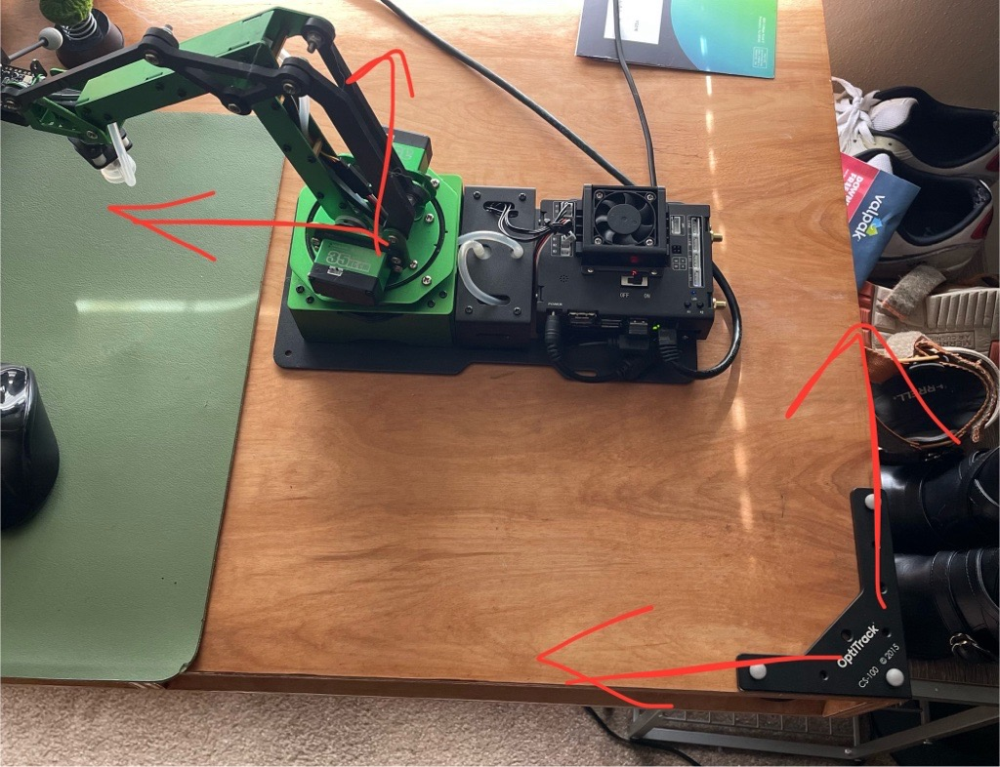
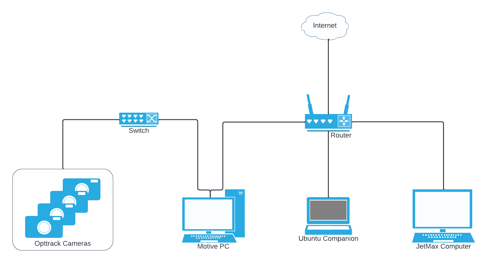

# Arm Follower demo on Hiwonder JetMax arm

This demo uses the `mocap4ros2_optitrack` package to allow the Hiwonder JetMax arm's end effector to follow an arbitrary rigid body using OptiTrack camera and Motive software.

### Outline

1. [About this Demo](#about-this-demo)
2. [Setup Requirements](#setup-requirements)
3. [OptiTrack Configuration](#optitrack-configuration)
4. [Configuring Ubuntu Companion Computer](#configuring-ubuntu-companion-computer)
5. [Configuring JetMax Computer](#configuring-jetmax-computer)
6. [Bringing Everything Together](#bringing-everything-together)  <!-- Network, validating setup, etc -->
7. [Running the Program](#running-the-program)
8. [Issues and Possible Improvements](#issues-and-possible-improvements)

See our [Robot OptiTrack Applications](robot_optitrack_applications.md) document for information about OptiTrack robotics example use cases.


## About this Demo

This demo is meant to give an example workflow for using an OptiTrack system to control a robotic arm. In this demo we use a 3DOF robot arm, the Hiwonder JetMax. This robot was chosen because of its affordability, desktop size, ROS2 support, and minimal setup needed to get up and going. The provided packages from [JetMaxRoboticArm](https://github.com/JetMaxRoboticArm) works well out of the box. 

The package provided by Hiwonder to control the arm with a python package, [jetmax_ebap](https://github.com/JetMaxRoboticArm/jetmax_ebap), can be adapted into a ROS package fairly easily.

While the scope of this example is limited to specific hardware, similar concepts should work with other robotic arms.


## Setup Requirements

Required Hardware:
 - A computer capable of running Motive and at least 3 OptiTrack cameras. (Tested on Motive 3.1)
 - Ubuntu 20.04 or greater computer. (It's not recommended use WSL2 due to networking issues - see [Unable to use WSL2](#unable-to-use-wsl2).)
 - [JetMax Hiwonder Robot](https://www.hiwonder.com/products/jetmax?variant=39645677125719)
 - A couple of rigid bodies and a calibration square.
 - A router with internet connection separate from the OptiTrack switch.
 - An ethernet cable to connect the JetMax to the router.

Software packages:
 - `jetmax_optitrack_feedback` package on the JetMax's Jetson Nano (original to this repository)
 - `mocap4ros2_optitrack` on the Ubuntu Companion computer (originally from https://github.com/OptiTrack/mocap4ros2_optitrack)
 - `mocap_msgs` on the Ubuntu Companion computer (originally from https://github.com/OptiTrack/mocap_msgs)
 - `tf_repub` on the Ubuntu Companion computer (original to this repository)


## OptiTrack Configuration

See our [Quick Start Guide](https://docs.optitrack.com/quick-start-guides/quick-start-guide-getting-started) for setting up your OptiTrack system, cameras, and Motive software. 

For an easier setup process, keep track of the orientation of the calibration square during the initial configuration. The orientation of the JetMax should match the following image when using a calibration square:


Create two rigid bodies `end_effector` and `base_link`. The rigid body for `base_link` needs to be fixed to the end effector. How the rigid body is fixed does not matter as long as it is at the end of the arm and can be picked up by cameras. For more tips on how to create great rigid bodies for tracking see [Rigid Body Tracking](https://docs.optitrack.com/motive/rigid-body-tracking).

Enable Streaming using [NatNet documentation](https://docs.optitrack.com/developer-tools/natnet-sdk). In the Streaming settings within Motive, make sure to set the local interface to an IP on the same network as the Ubuntu Companion computer.

<!-- TODO: Future work should account for the orientation of the robot see [Orientation of the JetMax](#orientation-of-the-jetmax) -->


## Configuring Ubuntu Companion Computer

For the test setup the Ubuntu companion computer was using Ubuntu 22.04 with ROS2 Iron. However, other setups such as Ubuntu 20.04+ with ROS2 Foxy and newer should work adequately.

Some familiarity with ROS will help in later steps. See https://docs.ros.org/en/iron/Tutorials.html

**ROS2 versions are somewhat dependent on your OS so pay attention to the version you install.**
For example, https://docs.ros.org/en/humble/Installation/Ubuntu-Install-Debians.html for Ubuntu 22.04

Creating package and setting up config files
```bash
cd ~
git clone https://github.com/OptiTrack/robot_arm_follower_demo.git
mkdir -p ~/optitrack_companion_ws/src
cd ~/optitrack_companion_ws/src
# copy mocap_msgs, mocap4ros2_optitrack, and tf_repub to the src directory
cp -r ~/robot_arm_follower_demo/packages_on_ubuntu_companion/* ~/optitrack_companion_ws/src
cd ~/optitrack_companion_ws
source /opt/ros/<your-ros-distro>/setup.bash
colcon build
```

If the build was successful, the `optitrack_companion_ws` should be populated with `build`, `install`, and `log` directories


## Configuring JetMax Computer

**IMPORTANT** - There are two paths for using the Jetson Nano on the JetMax robot:
1. Using the SD card image that ships with the JetMax, Ubuntu 20.04
2. Using a SD card image with a fresh install of [Ubuntu 18.04](https://developer.nvidia.com/embedded/learn/get-started-jetson-nano-devkit#write) supported by Nvidia

    See [The operating system of the Hiwonder JetMax](#the-operating-system-of-the-hiwonder-jetmax) for discussion on your decision to use one over the other.

    If you are using the SD card image that ships with the JetMax skip to [Building the code](#building-the-code)

    For our testing, the image on the installation on the SD card that shipped with the JetMax became corrupted at some point and we had trouble getting the original image from Hiwonder support. We ended up using a fresh install of Ubuntu 18.04 from Nvidia which worked fine.

3. Reflash with the SD card Getting Started guide from Nvidia
4. Download the jetson expansion board access package on the home directory and install:
    ```bash
    git clone https://github.com/JetMaxRoboticArm/jetmax_ebap.git
    cd jetmax_ebap
    python3 setup.py install
    ```
5. Test you can access the board using the [jetmax_ebap readme](https://github.com/JetMaxRoboticArm/jetmax_ebap). If you have permissions errors, temporarily see if using `sudo python3` before running commands allows you to access GPIO. 

6. At this point permission to access files by the user may need to be added using `chmod` or `adduser`.

7. Install ROS2 foxy with https://docs.ros.org/en/foxy/Installation.html

### Building the Code

Creating package and setting up config files
```bash
cd ~
git clone https://github.com/OptiTrack/robot_arm_follower_demo.git
mkdir -p ~/optitrack_robot_ws/src
cd ~/optitrack_robot_ws/src
# copy mocap_msgs, mocap4ros2_optitrack, and tf_repub to the src directory
cp -r ~/robot_arm_follower_demo/packages_on_jetmax/* ~/optitrack_robot_ws/src
cd ~/optitrack_robot_ws
source /opt/ros/<your-ros-distro>/setup.bash
colcon build
```


## Bringing Everything Together

This network diagram shows how to configure the necessary devices together.


In order to stream data to the JetMax computer from the Motive PC, an Ubuntu companion computer is needed to pass the messages to the JetMax. See [Need for companion computer](#need-for-companion-computer) for more info.

In short, the JetMax, Ubuntu Companion Computer, and Motive PC need to be on the same network that is optionally connected to the internet. This network needs to be separate from the network the OptiTrack cameras are on.


## Running the program

#### Launch Motive
Launch Motive and Enable Streaming on the Network the Ubuntu Companion Computer is on!

Create two rigid bodies:
 - "end_effector" - mount this to the end effector of the arm
 - "base_link" - have this nearby the robot arm (the exact position does not matter)

#### Launch the Ubuntu Companion Computer
```bash
# terminal 1
cd ~/optitrack_companion_ws
source install/setup.bash
ros2 launch mocap_optitrack_driver optitrack2.launch.py
```
```bash
# terminal 2
cd ~/optitrack_companion_ws
source install/setup.bash
ros2 run tf_repub transform_republisher
```

#### Launch the JetMax Arm
I recommend SSHing into the JetMax for this step.

```bash
# terminal 1
cd ~/optitrack_robot_ws
source install/setup.bash
ros2 run jetmax_optitrack_feedback jetmax_feedback_node
```

Ensure the "base_link" rigid body is near the robot.
```bash
# terminal 2
cd ~/optitrack_robot_ws
source install/setup.bash
ros2 topic pub /get_target_pos std_msgs/msg/Bool "data: True" --once
```

Start moving the base link rigid body to have the robot follow!

### What is going on?
In this demo, the JetMax tries to maintain a static distance between its end effector and the target rigid body. This is done by constantly measuring the distance between end_effector and base_link with OptiTrack. The robot see the change in distance and tries to compensate.

A [cartesian control command](https://wiki.ros.org/ros_controllers_cartesian) is issued to the robot and then an [inverse kinematics](https://en.wikipedia.org/wiki/Inverse_kinematics) engine computes the [target joint angles](https://wiki.ros.org/joint_state_controller) for the robot given a [description of the robot's mechanics](https://docs.ros.org/en/iron/Tutorials/Intermediate/URDF/URDF-Main.html).

Take a look at the links provided to get started on learning locomotion for a robot arm using ROS.

A more comprehensive example of Standard ROS practice can be found here:
[Universal_Robots_ROS2_Gazebo_Simulation](https://github.com/UniversalRobots/Universal_Robots_ROS2_Gazebo_Simulation)


## Issues and Possible Improvements

### Need for companion computer
The ubuntu companion computer was needed because at the time of writing, the NatNet binary was not available for ARM devices. This meant that the `mocap4ros2_optitrack` package had to live on a computer that did not have an ARM architecture.

When the ARM library for NatNet becomes more available `mocap4ros2_optitrack` would be able to run on an ARM device and a companion computer would not be needed

### Unable to use WSL2
The ubuntu companion computer could not be a WSL2 instance of the Windows host running Motive because it is difficult to network the WSL2 instance to be on the same LAN as the robot arm computer. By default, the network of the WSL2 instance is a NAT subset defined by the host windows machine. This link may be useful for giving a static IP on the same network as the windows host although this is untested: [assigning-static-ip-addresses-in-wsl2.md](https://gist.github.com/wllmsash/1636b86eed45e4024fb9b7ecd25378ce)

However, it is worth noting that the `mocap4ros2_optitrack` can be tested on WSL2 standalone because Motive and the WSL2 instance can easily exist on the network created by the windows host

### The operating system of the Hiwonder JetMax
The JetMax ships with an SD card with the Ubuntu 20.04 image and all of the JetMax packages on the image by default. However the installation of ROS running on the robot (ROS2 foxy) was broken in some way that caused a `std::bad_alloc` error when running any `ros2` command when another computer on the same network was broadcasting ROS2 messages.

I was unable to fix this issue, so I flashed the SD card with the official image for the Jetson Nano. This image contains Ubuntu 18.04. Ubuntu 18.04 is end of life and is losing support. I installed ROS2 Dashing and because it is losing support, transform (tf2) messages are not supported So I implemented the workaround which was to republish the tf2 messages with `tf_repub` package that lives on the Ubuntu Companion computer.

If a desired goal is to run the entire system on the JetMax, either 
1. the OS would need to be updated, 
2. there would need to be a solution to use tf2_ros (maybe using a C++ executable after building tf2 from source or figuring out how to install the tf2_ros python package),
3. you could run the system without using tf2 messages.

### Orientation of the JetMax

The orientation of the JetMax should not need to be fixed. Ideally in the future a few markers should be put on the base of the robot and then the calculated target position should take into account the orientation of the robot instead of assuming orientation.

